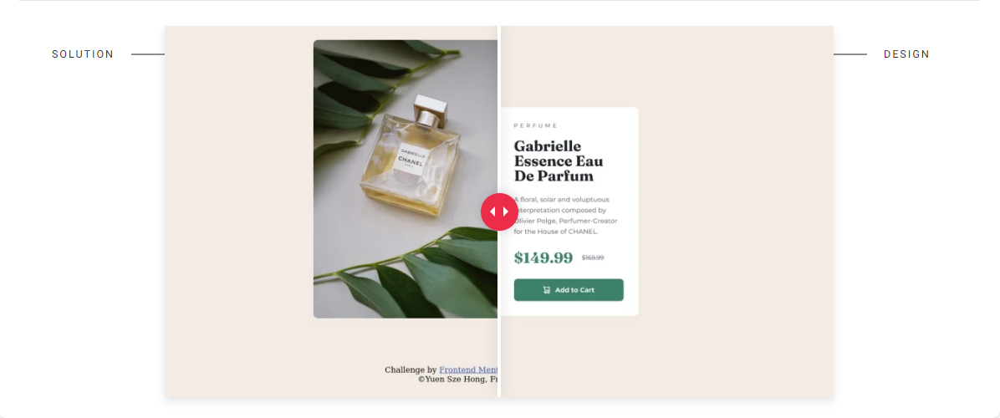

# Frontend Mentor - Product preview card component solution

This is a solution to the [Product preview card component challenge on Frontend Mentor](https://www.frontendmentor.io/challenges/product-preview-card-component-GO7UmttRfa). Frontend Mentor challenges help you improve your coding skills by building realistic projects.

## Table of contents

- [Frontend Mentor - Product preview card component solution](#frontend-mentor---product-preview-card-component-solution)
  - [Table of contents](#table-of-contents)
  - [Overview](#overview)
    - [Screenshot](#screenshot)
    - [The challenge](#the-challenge)
    - [Links](#links)
  - [My process](#my-process)
    - [Built with](#built-with)
  - [Author](#author)

## Overview

### Screenshot

### The challenge

Users should be able to:

- View the optimal layout depending on their device's screen size
- See hover and focus states for interactive elements

### Links

- Solution URL: [https://www.frontendmentor.io/solutions/vanilla-html-css-product-preview-card-47RcJ8dZ75](https://www.frontendmentor.io/solutions/vanilla-html-css-product-preview-card-47RcJ8dZ75)

- Live solution URL: [https://yuenszehong.github.io/product-preview-card-component/](https://yuenszehong.github.io/product-preview-card-component/)

## My process

### Built with

- Semantic HTML5 markup
- CSS custom properties
- Flexbox
- CSS Grid

## Author

- Frontend Mentor - [@YuenSzeHong](https://www.frontendmentor.io/profile/YuenSzeHong)
- Twitter - [@TheOneHong](https://www.twitter.com/TheOneHong)
